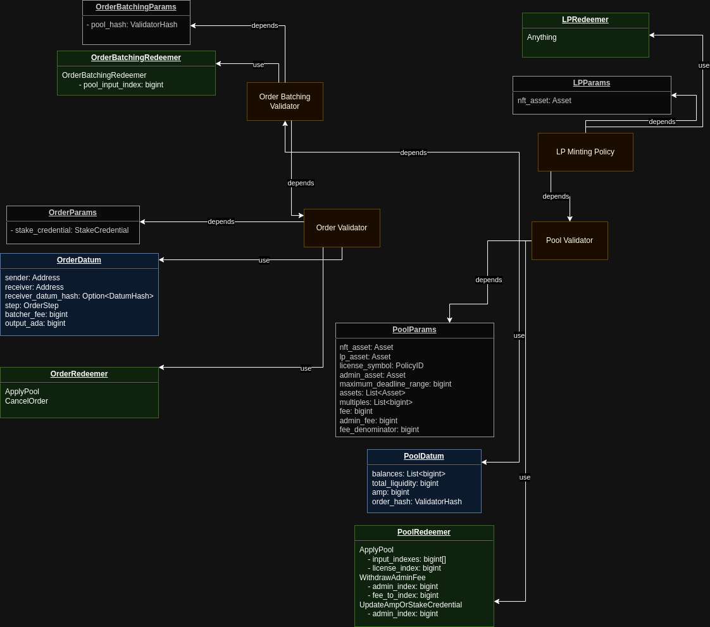
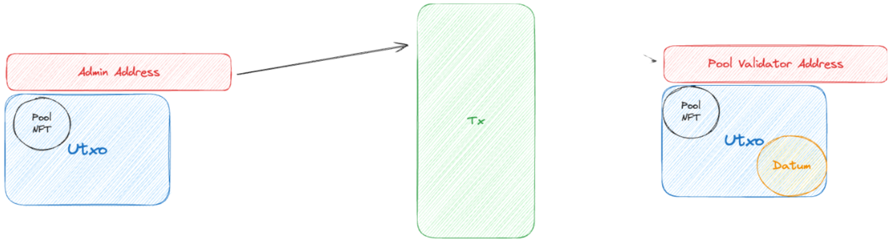
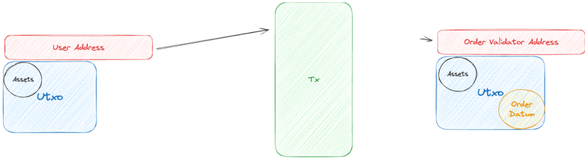
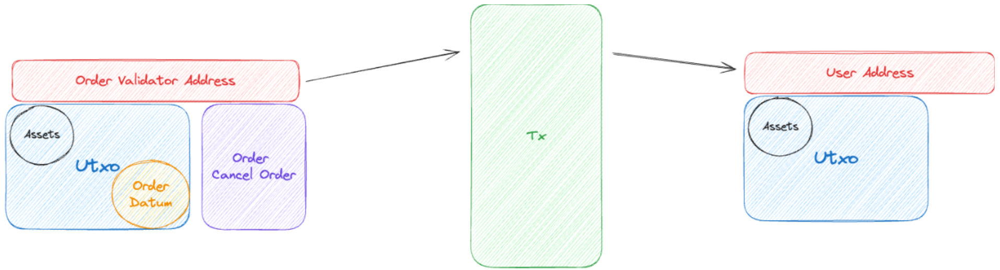
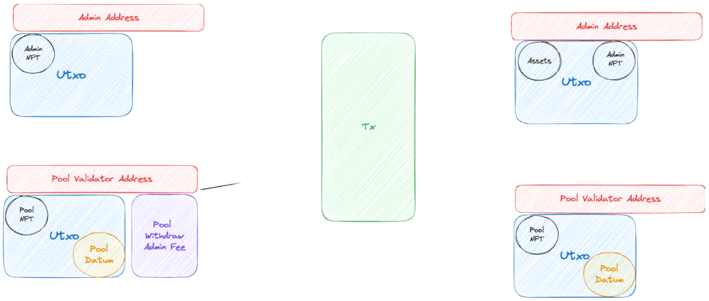

# Minswap Stableswap Specification

## 1. Overview

- Minswap Stableswap uses Curve's Stableswap model: https://classic.curve.fi/files/stableswap-paper.pdf. This model aims to provide low slippage and low fees when trading stablecoins. The key metric in this model is Amplification Coefficient (TODO: Do we need to explain how's A work?). References Curve's contract: https://etherscan.io/address/0xbebc44782c7db0a1a60cb6fe97d0b483032ff1c7#code
- The Stableswap uses Batching architecture to solve concurrency on Cardano. Each user action will create an "Order" and "Batcher" will look through them and apply them into a "Stable Pool". A valid "Batcher" is a wallet which contains Minswap's License Token. Batching transaction is permissioned and only is triggered by "Batcher".
- Limitations:
  - Current contract only supports non-ADA assets (i.e. a pool of ADA and ADA-pegged assets wouldn't be supported)

## 2. Architecture

There're 3 contracts in the Stableswap system:

- Order Contract: represents "User Action", contains necessary funds and is waiting to be applied into a Pool
- Pool Contract: a.k.a Liquidity Pool, which holds all User's assets for trading.
- Liquidity Contract: a Minting Policy whose tokens represents the "share" of Liquidity Providers in Liquidity Pool

## 3. Specification

### 3.1 Actors

- User: An entity who wants to interact with StableSwap to deposit/withdraw liquidity or swap. The only requirement of users is that they must not be the same as batcher (because of how we filter UTxOs) and should not be any another Smart Contract (because an pending Order can only be cancelled by User's signature in case of over-slippage).
- Batcher: An entity who aggregate order UTxOs from users and match them with liquidity pool UTxO. A batcher must hold a batcher's license token. The license token must not be expired and the expired time must be between current time and Maximum Deadline (to prevent minting license with infinity deadline).
- Admin (aka Minswap team): An entity who has permission to update pools' amplification coefficient, withdraw admin fee and change the pool's stake address. An Admin must hold admin's license token.

### 3.2 Tokens

- Pool NFT token: Assumed to be unique and can't be replicated. Pool NFT is minted by the team before creating a pool and will be put into the pool on creation. The team will choose the most secured way to mint the NFT (e.g. by using time-locked policy).
- LP token: Represents Liquidity Provider's share of pool. Each pool has different LP token.
  - CurrencySymbol: Liquidity Contract
  - TokenName: Same as pool NFT's TokenName.
- Batcher license token: Permit batcher to apply pool
  - CurrencySymbol: Defined in Pool parameters. The policy is managed by team (e.g. multisig policy)
  - TokenName: POSIX timestamp represents license deadline
- Admin license token:
  - CurrencySymbol: Defined in Pool parameters. The policy is managed by team (e.g. multisig policy)
  - TokenName: A constant string defined in pool parameters (e.g. "ADMIN")

### 3.3 Smart Contract

#### 3.3.1 Order Batching Validator

Order Batching validator is a Withdrawal Script, is responsible for validating Pool Representation in the Transaction Inputs. This validator will help reduce `Order Validator` cost in Batching Transaction.

#### 3.3.1.1 Parameter

- _pool_hash_: the hash of Liquidity Pool Script

#### 3.3.1.2 Redeemer

- **OrderBatchingRedeemer**:
   - _pool_input_index_: Index of Pool UTxO in Transaction Inputs.

#### 3.3.1.3 Validation

- **OrderBatchingRedeemer**: The redeemer contains `pool_input_index`, it's used for finding Pool Input faster, it will be called on Batching Transaction.
   - validate that there's a Pool Input which have Address's Payment Credential matching with `pool_hash`

#### 3.3.2 Order Validator

Order validator is responsible for holding "User Requests" funds and details about what users want to do with the liquidity pool. An order can only be applied to the liquidity pool by Batcher or cancelled by User's payment signature / Script Owner Representation (in case Owner is a Smart Contract)

#### 3.3.2.1 Parameter

- _stake_credential_: the Stake Credential of `Order Batching Validator`

#### 3.3.2.2 Datum

There are 5 order types:

- **Exchange**: is used for exchanging assets in the liquidity pool
  - _asset_in_index_: The index of asset which users want to exchange
  - _asset_out_index_: The index of asset which users want to exchange to
  - _minimum_asset_out_: Minimum amount of Asset Out which users want to receive after exchanging
- **Deposit**: is used for depositing pool's assets and receiving LP Token
  - _minimum_lp_: The minimum amount of LP Token which users want to receive after depositing
- **Withdraw**: is used for withdrawing pool's asset with the exact assets ratio of the liquidity pool at that time
  - _minimum_amounts_: minimum amounts of received assets. The array has the same length and index as assets inside pools
- **WithdrawImbalance**: is used for withdrawing custom amount of assets.
  - _amounts_out_: The exact amount of assets which users want to receive
- **WithdrawOneCoin**: is used for withdrawing a specific asset in the liquidity pool
  - _asset_out_index_: The index of the asset which users want to withdraw
  - _minimum_asset_out_: The minimum amount of Asset Out which users want to receive after withdrawal

An Order Datum keeps information about Order Type and some other informations:

- _sender_: The address of order's creator, only sender can cancel the order
- _receiver_: The address which receives the funds after order is processed
- _receiver_datum_hash_: (optional) the datum hash of the output after order is processed.
- _step_: The information about Order Type which we mentioned above
- _batcher_fee_: The fee users have to pay to Batcher to execute batching transaction
- _output_ada_: As known as Minimum ADA which users need to put to the Order, and these amounts will be returned with _receiver_ Output

#### 3.3.2.3 Redeemer

There're 2 order actions:

- **ApplyOrder**
- **CancelOrder**

#### 3.3.2.4 Validation

- **ApplyOrder**: the redeemer will allow spending Order UTxO in Batching transaction 
  - validate that an Order can be spent if there's a single Pool UTxO that matches with _pool_validator_hash_ parameter in the transaction inputs. The rest of validation is delegated to pool script
- **CancelOrder**: the redeemer will allow _sender_ to spend Order UTxO to get back locked funds.
  - validate that the transaction has _sender_'s signature or _sender_ script UTxO in the Transaction Inputs

### 3.3.3 Liquidity Minting Policy

Liquidity Minting Policy is responsible for making sure only Pool Validator can mint LP, other validations related how many LP will be minted will be forwarded to Pool Validator

#### 3.3.3.1 Parameter

- _nft_asset_: is known as Pool NFT asset which identifies Pool and make sure that Liquidity Pool is unique

#### 3.3.3.2 Redeemer

None

#### 3.3.3.3 Validation

- Validate that the transaction must have a Pool UTxO holding 1 NFT Asset in both the inputs and outputs
- Validate that transaction must only mint LP asset and LP Asset must have the same TokenName with NFT Asset

#### 3.3.4 Pool Validator

Pool validator is the most important part in the system. It's responsible for guaranteeing that Orders must be processed in the correct way and Liquidity Providers' funds cannot be stolen in any way.

#### 3.3.4.1 Parameter

- _nft_asset_: a.k.a Pool NFT asset which identifies Pool and make sure that the Liquidity Pool is unique
- _lp_asset_: is the "share" asset which is created by the Liquidity Minting Policy
- _license_symbol_: is the policy ID managed by the Minswap team, used for minting Batcher License and Admin License assets
- _admin_asset_: is used to identify Admin, can interact with _WithdrawAdminFee_ and _UpdateAmpOrStakeCredential_ redeemer
- _maximum_deadline_range_: is the maximum expiration time of Batcher license from now (to prevent minting infinity license)
- _assets_: the stable assets which the Pool supports trading
- _multiples_: is the multiple of stable assets, using for calculation between stable assets with different decimals
- _fee_: the **numerator** of the fee % users need to pay when interacting with the pool
- _admin_fee_: the **numerator** of the % of the fee that goes to Admin
- _fee_denominator_: is the **denominator** of _fee_ and _admin_fee_, which help calculation more accurate

#### 3.3.4.3 Datum

- _balances_: is the balances of Pool's assets, has the same index with _assets_ in Pool's parameters
- _total_liquidity_: is the Total Liquidity (which is equals with total amount of minted LP Token)
- _amp_: is known as Amplification Coefficient, is the key metric in whole Stableswap system.
- _order_hash_: Validator Hash of Order Contract

#### 3.3.4.3 Redeemer

There're 3 pool actions:

- **ApplyPool**: can only be triggered by Batcher, allow Batcher to take Order UTxOs and apply them to Liquidity Pool
- **WithdrawAdminFee**: can only be trigged by Admin, allow Admin to withdraw earned Admin Fee
- **UpdateAmpOrStakeCredential**: can only be trigged by Admin, allow Admin to update Amplification Coefficient configuration or update Pool's Stake Credential

#### 3.3.4.4 Validation

- **ApplyPool**:
  - Having only one Pool Input and Output in the transaction. The Pool Input and Output must have the same Address (both payment and stake credential part)
  - Pool NFT must exist in Pool Input and Output value
  - Pool Value must only contain necessary tokens inside:
    - Minimum ADA
    - Pool NFT Asset
    - Stable Assets (which is defined in Pool Paramters)
  - Batcher with valid license token must be a signer of transaction. A valid license token is the token having expired timestamp as TokenName and must be within current time and current time + _maximum_deadline_range_
  - Irrelevant field (which is Amplification Coefficient) in Pool datum must be unchanged.
    - Validate the Pool State (datum balances, value balances and total_liquidity) must be the same with the calculated amount after applying through all orders. The validator will loop through the list of batch inputs and outputs and validate each one, as well as calculate the final state of the pool. Important note that order inputs are sorted lexicographically due to Cardano ledger's design, so the Batcher will pre-calculate correct order inputs indexes, pass through the redeemer (input_indexes) and validator will sort the Order Inputs with the indexes to make sure that Orders will be processed with FIFO ordering
    - Validate that transaction can only mint LP Token if having any order requires minting LP. Otherwise, transaction doesn't mint anything
    - Balances in Pool In/Out datum must have the same length with Pool Assets
- **WithdrawAdminFee**:
  - Having only one Pool Input and Output in the transaction. This redeemer doesn't allow any other scripts except Pool's script in the Inputs or Outputs
  - Pool NFT must exist in Pool Input and Output value
  - Pool Value must only contain necessary token inside:
    - Minimum ADA
    - Pool NFT Asset
    - Stable Assets (which is defined in Pool Parameters)
  - This transaction doesn't mint anything
  - Pool Datum must be unchanged in this redeemer
  - Only Admin token can trigger this redeemer
  - Admin can only withdraw the exact accumulated admin fee amounts. These amounts are calculated by the difference of Pool Value and Datum Balances
  - After Admin Fee amounts are withdrawn, Pool Value must be equals to Datum balances
- **UpdateAmpOrStakeCredential**:
  - Having only one Pool Input and Output in the transaction. This redeemer doesn't allow any other scripts except Pool script in the Inputs or Outputs
  - Pool NFT must exist in Pool Input and Output value
  - Pool Value must only contain necessary tokens inside:
    - Minimum ADA
    - Pool NFT Asset
    - Stable Assets (which is defined in Pool Parameters)
  - This transaction doesn't mint anything
  - Irrelevant fields (_balances_, _total_liquidity_) in Pool datum must be unchanged
  - Only Admin license token can trigger this redeemer
  - Pool Value must be unchanged in this redeemer

### 3.4 Transaction

#### 3.4.1 Create Pool

Create Pool transaction is quite simple. Because each Pool has to include a Pool NFT asset. Transaction only create a Pool UTxO which has Pool NFT inside and some initial datum. There's no validation for pool creation, and pools that users can interact on Minswap interface are created and whitelisted by Minswap team. Those pools (and their NFTs) are assumed to be created correctly.

Pool UTxO includes:

- Value:
  - Minimum ADA
  - Pool NFT
- Datum:
  - balances: an array having N elements, each element has _0_ value
  - total_liquidity: 0
  - amp: initial Amplication Coefficient (decided by Minswap team)
  - _order_hash_: is the Validator Hash of `Order Contract`

#### 3.4.3 Create Order

Create Order transaction will transfer User funds into an Order UTxO.

Besides common information such as _sender_, _receiver_, etc, each order type requires different information in _step_ field (note that we only mention _field name_ here, the fields' descriptions have been explained above):

- **Exchange**:
  - Datum:
    - _asset_in_index_
    - _asset_out_index_
    - _minimum_asset_out_
  - Value:
    - Output ADA + Batcher Fee
    - Asset In + its amount
- **Deposit**:
  - Datum:
    - _minimum_lp_
  - Value:
    - Output ADA + Batcher Fee
    - Assets which users want to deposit + their amounts
- **Withdraw**:
  - Datum:
    - _minimum_amounts_
  - Value:
    - Output ADA + Batcher Fee
    - LP Token + its amount
- **WithdrawImbalance**:
  - Datum:
    - _amounts_out_
  - Value:
    - Output ADA + Batcher Fee
    - LP Token + its amount
- **WithdrawOneCoin**:
  - Datum:
    - _asset_out_index_
    - _minimum_asset_out_
  - Value:
    - Output ADA + Batcher Fee
    - LP Token + its amount

#### 3.4.3 Cancel Order

Cancel Order transaction will spend Order UTxO and take users' fund back to their wallet.
This transaction requires the _sender_'s signature or _sender_ script UTxO in the Transaction Inputs

#### 3.4.4 Batching

Batching transaction is the most complex structure.

It requires a Pool UTxO, Batcher UTxOs (must include Batcher License Token) and Order UTxOs which are applying to the Pool UTxO

Batcher will:

- Find all pending Orders (Order UTxOs) in the blockchain, sort them by FIFO ordering
- Find corresponding Pool UTxO that matches with these Orders
- Loop through Orders, apply them to the Pool UTxO, then calculate User funds after their requests are processed. The users' funds have to pay to _receiver_ Address and include _receiver_datum_hash_ (if present)
  - **Exchange**:
    - Value:
      - Output ADA
      - Asset Out + its amount (must be greater than _minimum_asset_out_)
  - **Deposit**:
    - Value:
      - Output ADA
      - LP Token + its amount (must be greater than _minimum_lp_)
  - **Withdraw**:
    - Value:
      - Output ADA
      - Pool Assets + their amounts (must be greater than _minimum_amounts_)
  - **WithdrawImbalance**:
    - Value:
      - Output ADA
      - Pool Assets + their amounts (must be exact _amounts_out_)
      - LP Token + change amount of LP Token (because slippage of this order affects LP Token which users put in Order, so LP Token may have changed after executing Batching transaction. This amount will be returned to _receiver_)
  - **WithdrawOneCoin**:
    - Value:
      - Output ADA
      - Asset Out + its amount (must be greater than _minimum_asset_out_)
- Take _Batcher Fee_ of all Orders, a part of them will be used for Transaction Fee, the remaining amount will be kept on Batcher wallet

#### 3.4.5 Withdraw Admin Fee

Withdrawing Admin Fee transaction requires Admin's License Token.

The transaction will spend Admin's License Token, calculate earned Admin Fee amounts and pay them to Admin Wallet.

#### 3.4.6 Update Amplification Coefficient or Update Pool's Stake Credential

This transaction can either update Amplification Coefficient or update Pool's Stake Credential.

It will spend Pool UTxO and modify _Amp_ configuration in Pool's Datum and take Datum & Value inside Pool UTxO to new UTxO (which has the same _payment_credential_ and new _stake_credential_ part)

